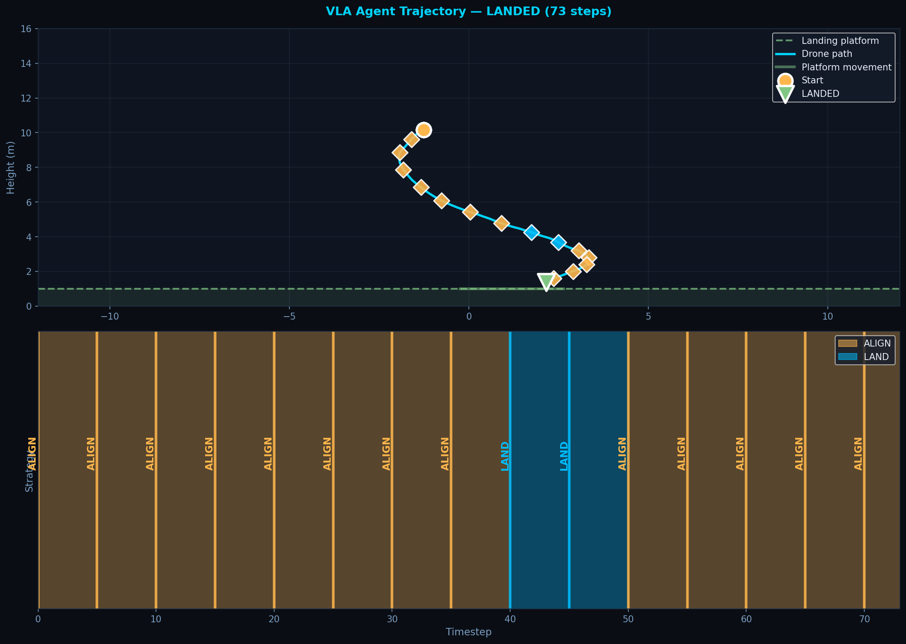
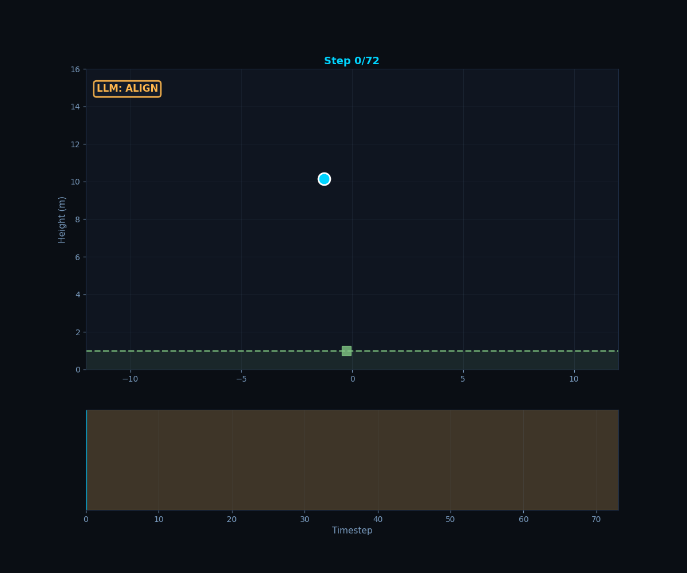
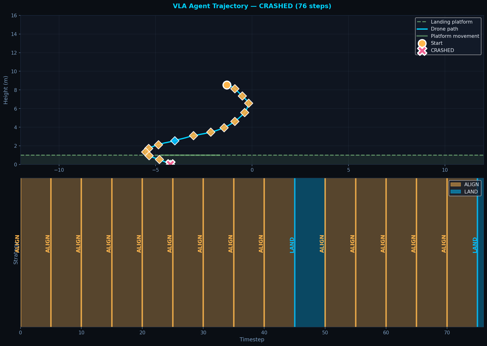
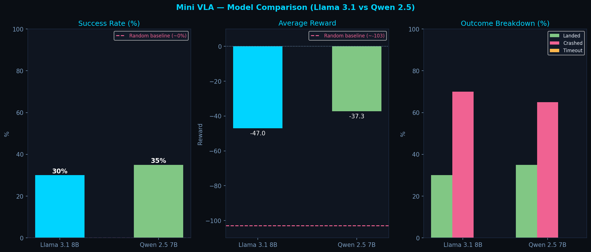

# Mini VLA — Vision-Language-Action Drone Control

A minimal Vision-Language-Action architecture for autonomous drone landing — inspired by production systems like Google RT-2, built to run entirely on local hardware with open-source LLMs.

> **Note:** This is a research prototype demonstrating the VLA paradigm at small scale. It is not a production system. The architecture mirrors how real VLA systems work — the gap is compute and model size, not fundamentals.

---

## Demo

The VLA agent observes the drone state, reasons about it in natural language, and outputs control actions. Here's what the pipeline looks like in action:

```
[Vision Encoder]
DRONE STATUS:
- Position: 2.0m to the LEFT of the platform, 3.5m above
- Motion: descending at 2.1 m/s, stable horizontally
- Platform: moving RIGHT at 0.8 m/s

[LLM Reasoning] → LAND

[Rule-based Controller] → THRUST_UP (slow descent)
→ NO_THRUST (gentle fall onto platform)

✓ LANDED — Reward: 92.9
```

## Visualization

### Successful Landing



The agent starts with ALIGN strategy, moving the drone horizontally to position it above the moving platform. Once aligned, the LLM switches to LAND strategy (blue zone in timeline), and the rule-based controller executes a gentle descent onto the platform. The diamonds on the trajectory mark LLM decision points.



### Crash Example



In this episode, the drone fails to slow its descent in time. The LLM correctly identifies the need to land, but the rule-based controller's thresholds don't brake aggressively enough at high speeds, resulting in a crash. This highlights the limitation of fixed thresholds vs learned policies — an RL agent would have learned more conservative behavior through trial and error.

The timeline clearly shows when the LLM switches strategies, demonstrating the hybrid architecture in action.

---

## Architecture

```
Drone State (6 values)
       │
       ▼
┌─────────────────┐
│  Vision Encoder │  converts state to natural language description
└────────┬────────┘
         │  "Drone is 2m left of platform, descending at 3 m/s..."
         ▼
┌─────────────────┐
│   LLM Reasoner  │  local Llama 3.1 / Qwen 2.5 via Ollama
│  (every N steps)│  outputs high-level strategy: ALIGN or LAND
└────────┬────────┘
         │  "LAND"
         ▼
┌─────────────────┐
│  Rule-based     │  executes precise low-level actions
│  Controller     │  based on strategy + physics constraints
└────────┬────────┘
         │  action: 0=thrust_left, 1=thrust_up, 2=thrust_right, 3=none
         ▼
┌─────────────────┐
│   Drone Env     │  2D physics simulation (gravity, thrust, drag)
└─────────────────┘
```

**Why hybrid?**
Pure LLM control (querying the model every step) achieves 0% success — small open-source models lack the sequential reasoning needed for real-time control. The hybrid approach — LLM for high-level strategy, rule-based for precise actuation — achieves 30-35% success. This mirrors how real robotics VLA systems work.

---

## Results



### Model Comparison (20 episodes each, identical starting conditions)

| Model | Success Rate | Avg Reward | vs Random |
|-------|-------------|------------|-----------|
| Qwen 2.5 7B | **35%** | -37.3 | +35% |
| Llama 3.1 8B | 30% | -47.0 | +30% |
| Random baseline | ~0% | ~-103 | — |

**Key finding:** Under identical seeded starting conditions, Qwen 2.5 7B outperforms Llama 3.1 8B (35% vs 30%), consistent with Qwen's stronger structured instruction-following capabilities. Both models significantly exceed the random baseline.

---

## Key Design Decisions

**Why local LLMs?**
Running entirely on-device (RTX 4070) with no cloud dependency. Privacy-preserving, zero latency overhead from API calls, and aligned with the energy efficiency motivation behind the project.

**Why binary strategy (ALIGN/LAND)?**
Initial experiments with 4-strategy classification (ALIGN/DESCEND/BRAKE/LAND) showed Llama 3.1 8B consistently defaulting to ALIGN regardless of context. Simplifying to binary decisions dramatically improved LLM reliability — a practical finding about capability limitations of smaller models in structured reasoning tasks.

**Why hybrid instead of pure LLM?**
Pure LLM control (every step) achieved 0% success across 30+ episodes. The LLM lacks temporal memory between calls — it cannot learn from oscillating behavior within an episode. The hybrid approach offloads time-critical actuation to a deterministic controller while preserving LLM reasoning for high-level planning.

---

## Environment

Reused from [drone-landing-rl](https://github.com/nassib-es/drone-landing-rl) — custom 2D physics simulation.

| Parameter | Value |
|-----------|-------|
| State | [drone_x, drone_y, vel_x, vel_y, platform_x, platform_vel] |
| Actions | 4: thrust left/up/right, no thrust |
| Gravity | -9.8 m/s² |
| Platform speed | 0.8 m/s (moving target) |
| Landing condition | On platform, gentle velocity |

---

## Setup

### Requirements
- [Ollama](https://ollama.com) installed and running
- Llama 3.1 and/or Qwen 2.5 pulled

```bash
ollama pull llama3.1
ollama pull qwen2.5
ollama serve
```

### Install dependencies
```bash
pip install numpy matplotlib requests
```

### Run
```bash
# Single episode (verbose)
python src/run.py

# Full model comparison benchmark
python src/benchmark.py

# Plot results
python src/plot_results.py
```

---

## Project Structure

```
mini-vla/
├── src/
│   ├── vision_encoder.py   # state → natural language description
│   ├── llm_reasoner.py     # LLM strategy decisions via Ollama
│   ├── action_decoder.py   # text → action integer
│   ├── vla_agent.py        # hybrid VLA orchestrator
│   ├── run.py              # single episode runner
│   ├── benchmark.py        # model comparison benchmark
│   └── plot_results.py     # visualization
├── env/
│   └── drone_env.py        # 2D physics simulation
├── models/                 # benchmark results (not tracked)
└── docs/
    └── benchmark_results.png
```

---

## Limitations & Future Work

- **30-35% success** is promising but not reliable enough for real deployment
- **No temporal memory** — LLM reasons about each window independently, cannot track trends
- **Binary strategy** — a more capable model (Claude, GPT-4) would handle richer strategy spaces
- **2D simulation only** — real drone requires 6DOF dynamics and actual camera vision
- **Next step:** replace rule-based controller with a trained RL policy (combining VLA reasoning with DQN execution)

---

## Comparison to Production VLA Systems

| Aspect | This project | Google RT-2 |
|--------|-------------|-------------|
| Vision input | State vector → text | Real camera frames |
| LLM size | 7-8B params (local) | 55B+ params (cloud) |
| Strategy space | 2 classes | Open-ended language |
| Success rate | 30-35% | ~60-80% |
| Hardware | Single RTX 4070 | TPU clusters |
| Cost | $0 (local) | Millions |

---

## Author
Nassib El Saghir — [LinkedIn](https://linkedin.com/in/nassib-el-saghir) — [GitHub](https://github.com/nassib-es)
